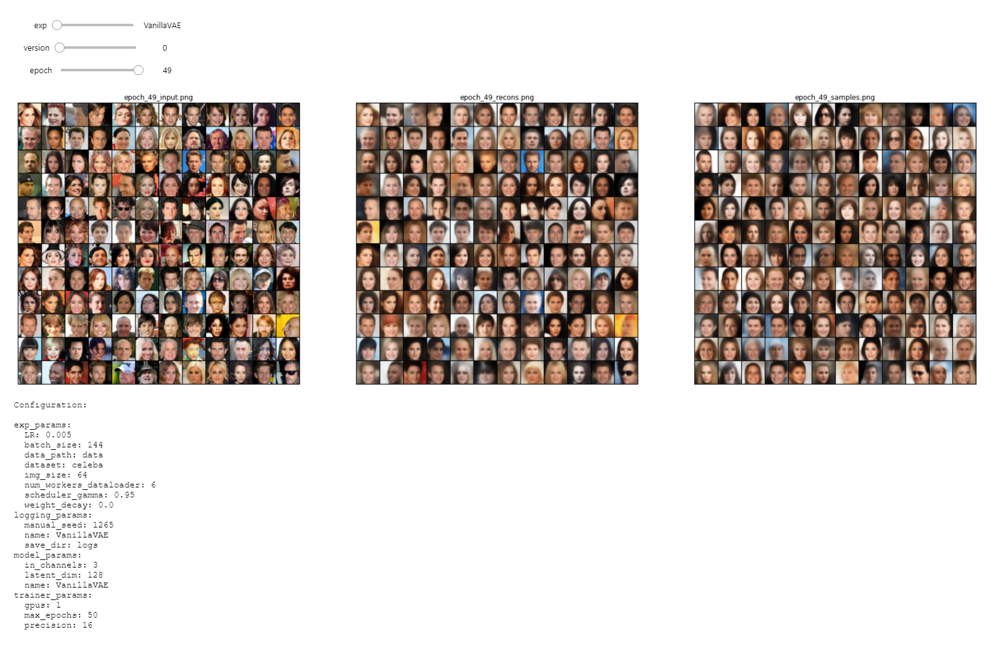

<h1 align="center"> VAE Collection </h1>

<p align="center">
      <a href="https://www.python.org/">
        </a>
       <a href= "https://pytorch.org/">
        </a>
       <a href= "https://github.com/saravanabalagi/vae_collection/blob/master/LICENSE.md">
        </a>
</p>

A collection of Variational AutoEncoders (VAEs) implemented in pytorch with focus on reproducibility. The aim of this project is to provide
a quick and simple working example for many of the cool VAE models out there. 

All the models are trained on the [CelebA dataset](http://mmlab.ie.cuhk.edu.hk/projects/CelebA.html)
for consistency and comparison. The architecture of all the models are kept as similar as possible with the same layers, except for cases where the original paper necessitates 
a radically different architecture (Ex. VQ VAE uses Residual layers and no Batch-Norm, unlike other models).
Here are the [results](#results) of each model. 

Forked from [PyTorch-VAE](https://github.com/AntixK/PyTorch-VAE). This fork updates the code to make it function with Python 3.8, PyTorch 1.9, Tensorboard 2.5 and PyTorch Lightning 1.4. There are some additional modifications to speed up the training such as parallel data workers, 16-bit precision, etc.

## Installation

This repo uses [poetry](https://python-poetry.org/) for managing dependencies

```sh
git clone https://github.com/saravanabalagi/vae_collection
cd vae_collection
poetry install
```

If you need CUDA GPU support, install PyTorch CUDA manually after activating the environment:

```sh
poetry shell # or
source .venv/bin/activate

pip install torch==1.9.0+cu111 torchvision==0.10.0+cu111 -f https://download.pytorch.org/whl/torch_stable.html
```

## Training
```sh
python run.py -c configs/<config-file-name.yaml>
```
### Config file template
```yaml
model_params:
  name: "<name of VAE model>"
  in_channels: 3
  latent_dim: 
    .         # Other parameters required by the model
    .
    .

exp_params:
  dataset: 'celeba'
  data_path: '<path to the celebA dataset>'
  num_workers_dataloader: 6   # Number of parallel workers for loading (and augmenting) data 
  img_size: 64                # Models are designed to work for this size
  batch_size: 144             # Better to have a square number
  LR: 0.005
  weight_decay:
    .         # Other arguments required for training, like scheduler etc.
    .
    .

trainer_params:
  gpus: 1         
  max_epochs: 50
  precision: 16             # Uses 16-bit floats to accelerate training
  gradient_clip_val: 1.5
    .
    .
    .

logging_params:
  save_dir: 'logs'
  name: '<experiment name>'
  manual_seed: 
```

### View TensorBoard Logs
```sh
cd logs/<experiment_name>/version_<the version you want>
tensorboard --logdir tf
```

### Comparison of Config and Results

Input, Reconstructions, Samples and Experiment Config can be compared across epochs for different experiments and versions in this [notebook](results_compare.ipynb)



----
## Results


| Model                                                                  | Paper                                            |Reconstruction | Samples |
|------------------------------------------------------------------------|--------------------------------------------------|---------------|---------|
| VAE ([Code][vae_code], [Config][vae_config])                           |[Link](https://arxiv.org/abs/1312.6114)           |    ![][2]     | ![][1]  |
| Conditional VAE ([Code][cvae_code], [Config][cvae_config])             |[Link](https://openreview.net/forum?id=rJWXGDWd-H)|    ![][16]    | ![][15] |
| WAE - MMD (RBF Kernel) ([Code][wae_code], [Config][wae_rbf_config])    |[Link](https://arxiv.org/abs/1711.01558)          |    ![][4]     | ![][3]  |
| WAE - MMD (IMQ Kernel) ([Code][wae_code], [Config][wae_imq_config])    |[Link](https://arxiv.org/abs/1711.01558)          |    ![][6]     | ![][5]  |
| Beta-VAE ([Code][bvae_code], [Config][bbvae_config])                   |[Link](https://openreview.net/forum?id=Sy2fzU9gl) |    ![][8]     | ![][7]  |
| Disentangled Beta-VAE ([Code][bvae_code], [Config][bhvae_config])      |[Link](https://arxiv.org/abs/1804.03599)          |    ![][22]    | ![][21] |
| Beta-TC-VAE ([Code][btcvae_code], [Config][btcvae_config])             |[Link](https://arxiv.org/abs/1802.04942)          |    ![][34]    | ![][33] |
| IWAE (*K = 5*) ([Code][iwae_code], [Config][iwae_config])              |[Link](https://arxiv.org/abs/1509.00519)          |    ![][10]    | ![][9]  |
| MIWAE (*K = 5, M = 3*) ([Code][miwae_code], [Config][miwae_config])    |[Link](https://arxiv.org/abs/1802.04537)          |    ![][30]    | ![][29] |
| DFCVAE   ([Code][dfcvae_code], [Config][dfcvae_config])                |[Link](https://arxiv.org/abs/1610.00291)          |    ![][12]    | ![][11] |
| MSSIM VAE    ([Code][mssimvae_code], [Config][mssimvae_config])        |[Link](https://arxiv.org/abs/1511.06409)          |    ![][14]    | ![][13] |
| Categorical VAE   ([Code][catvae_code], [Config][catvae_config])       |[Link](https://arxiv.org/abs/1611.01144)          |    ![][18]    | ![][17] |
| Joint VAE ([Code][jointvae_code], [Config][jointvae_config])           |[Link](https://arxiv.org/abs/1804.00104)          |    ![][20]    | ![][19] |
| Info VAE   ([Code][infovae_code], [Config][infovae_config])            |[Link](https://arxiv.org/abs/1706.02262)          |    ![][24]    | ![][23] |
| LogCosh VAE   ([Code][logcoshvae_code], [Config][logcoshvae_config])   |[Link](https://openreview.net/forum?id=rkglvsC9Ym)|    ![][26]    | ![][25] |
| SWAE (200 Projections) ([Code][swae_code], [Config][swae_config])      |[Link](https://arxiv.org/abs/1804.01947)          |    ![][28]    | ![][27] |
| VQ-VAE (*K = 512, D = 64*) ([Code][vqvae_code], [Config][vqvae_config])|[Link](https://arxiv.org/abs/1711.00937)          |    ![][31]    | **N/A** |
| DIP VAE ([Code][dipvae_code], [Config][dipvae_config])                 |[Link](https://arxiv.org/abs/1711.00848)          |    ![][36]    | ![][35] |


<!-- | Gamma VAE             |[Link](https://arxiv.org/abs/1610.05683)          |    ![][16]    | ![][15] |-->

<!--
### TODO
- [x] VanillaVAE
- [x] Beta VAE
- [x] DFC VAE
- [x] MSSIM VAE
- [x] IWAE
- [x] MIWAE
- [x] WAE-MMD
- [x] Conditional VAE- [ ] PixelVAE
- [x] Categorical VAE (Gumbel-Softmax VAE)
- [x] Joint VAE
- [x] Disentangled beta-VAE
- [x] InfoVAE
- [x] LogCosh VAE
- [x] SWAE
- [x] VQVAE
- [x] Beta TC-VAE
- [x] DIP VAE
- [ ] Ladder VAE (Doesn't work well)
- [ ] Gamma VAE (Doesn't work well) 
- [ ] Vamp VAE (Doesn't work well)
-->

## License

Please see attached [LICENSE](LICENSE). License of the upstream repo is available [here](https://github.com/AntixK/PyTorch-VAE/blob/master/LICENSE.md)

-----------

[vae_code]: models/vanilla_vae.py
[cvae_code]: models/cvae.py
[bvae_code]: models/beta_vae.py
[btcvae_code]: models/betatc_vae.py
[wae_code]: models/wae_mmd.py
[iwae_code]: models/iwae.py
[miwae_code]: models/miwae.py
[swae_code]: models/swae.py
[jointvae_code]: models/joint_vae.py
[dfcvae_code]: models/dfcvae.py
[mssimvae_code]: models/mssim_vae.py
[logcoshvae_code]: models/logcosh_vae.py
[catvae_code]: models/cat_vae.py
[infovae_code]: models/info_vae.py
[vqvae_code]: models/vq_vae.py
[dipvae_code]: models/dip_vae.py

[vae_config]: configs/vae.yaml
[cvae_config]: configs/cvae.yaml
[bbvae_config]: configs/bbvae.yaml
[bhvae_config]: configs/bhvae.yaml
[btcvae_config]: configs/betatc_vae.yaml
[wae_rbf_config]: configs/wae_mmd_rbf.yaml
[wae_imq_config]: configs/wae_mmd_imq.yaml
[iwae_config]: configs/iwae.yaml
[miwae_config]: configs/miwae.yaml
[swae_config]: configs/swae.yaml
[jointvae_config]: configs/joint_vae.yaml
[dfcvae_config]: configs/dfc_vae.yaml
[mssimvae_config]: configs/mssim_vae.yaml
[logcoshvae_config]: configs/logcosh_vae.yaml
[catvae_config]: configs/cat_vae.yaml
[infovae_config]: configs/infovae.yaml
[vqvae_config]: configs/vq_vae.yaml
[dipvae_config]: configs/dip_vae.yaml

[1]: assets/Vanilla%20VAE_25.png
[2]: assets/recons_Vanilla%20VAE_25.png
[3]: assets/WAE_RBF_18.png
[4]: assets/recons_WAE_RBF_19.png
[5]: assets/WAE_IMQ_15.png
[6]: assets/recons_WAE_IMQ_15.png
[7]: assets/BetaVAE_H_20.png
[8]: assets/recons_BetaVAE_H_20.png
[9]: assets/IWAE_19.png
[10]: assets/recons_IWAE_19.png
[11]: assets/DFCVAE_49.png
[12]: assets/recons_DFCVAE_49.png
[13]: assets/MSSIMVAE_29.png
[14]: assets/recons_MSSIMVAE_29.png
[15]: assets/ConditionalVAE_20.png
[16]: assets/recons_ConditionalVAE_20.png
[17]: assets/CategoricalVAE_49.png
[18]: assets/recons_CategoricalVAE_49.png
[19]: assets/JointVAE_49.png
[20]: assets/recons_JointVAE_49.png
[21]: assets/BetaVAE_B_35.png
[22]: assets/recons_BetaVAE_B_35.png
[23]: assets/InfoVAE_31.png
[24]: assets/recons_InfoVAE_31.png
[25]: assets/LogCoshVAE_49.png
[26]: assets/recons_LogCoshVAE_49.png
[27]: assets/SWAE_49.png
[28]: assets/recons_SWAE_49.png
[29]: assets/MIWAE_29.png
[30]: assets/recons_MIWAE_29.png
[31]: assets/recons_VQVAE_29.png
[33]: assets/BetaTCVAE_49.png
[34]: assets/recons_BetaTCVAE_49.png
[35]: assets/DIPVAE_83.png
[36]: assets/recons_DIPVAE_83.png
